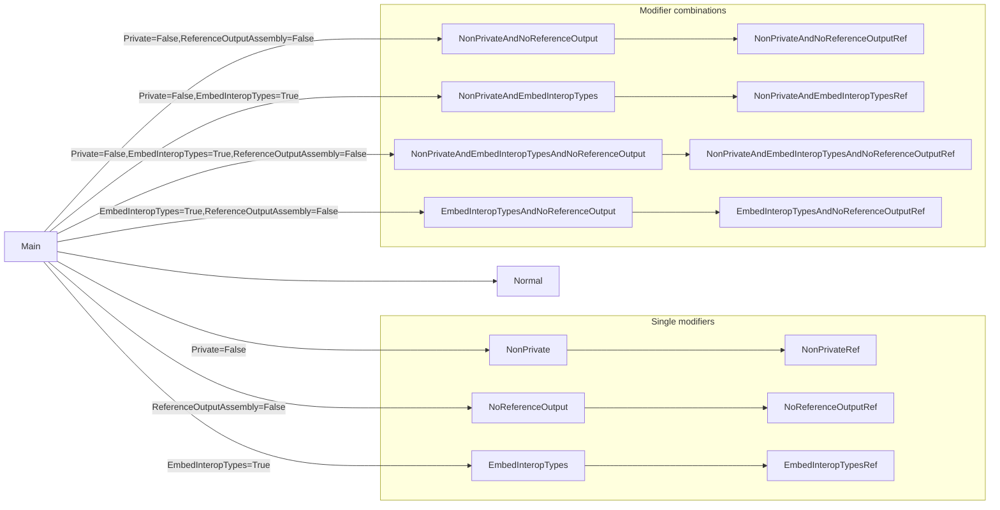

# Project reference modifiers

We identify the following modifiers are impacting how copy items are handled across P2P references:

- `Private` defaults to `true`. When `false`, means the project's outputs are public somehow (e.g. in the GAC) and don't need to be copied to the output directory.
- `EmbedInteropTypes` defaults to `false`. When `true` means the referenced project's types should be embedded and its compilation outputs not copied.
- `ReferenceOutputAssembly` defaults to `true`. When `false` means what the name implies, though also relates to other compilation outputs such as PDB and XML documentation.

These may be combined.

# Scenarios

We have several .NET projects arranged in the following P2P graph:

Each project has a `CopyToOutputDirectory="PreserveNewest"` item with that project's name and extension `.txt`.

Building the `Main` project produces the following files in its output `Main\bin\Debug\net6.0`:

- EmbedInteropTypes.txt
- EmbedInteropTypesAndNoReferenceOutput.txt
- EmbedInteropTypesAndNoReferenceOutputRef.txt
- EmbedInteropTypesRef.dll
- EmbedInteropTypesRef.pdb
- EmbedInteropTypesRef.txt
- EmbedInteropTypesRef.xml
- Main.dll
- Main.pdb
- Main.txt
- Main.xml
- NonPrivateAndEmbedInteropTypesRef.dll
- NonPrivateAndEmbedInteropTypesRef.pdb
- NonPrivateAndEmbedInteropTypesRef.txt
- NonPrivateAndEmbedInteropTypesRef.xml
- NonPrivateRef.dll
- NonPrivateRef.pdb
- NonPrivateRef.txt
- NonPrivateRef.xml
- NoReferenceOutput.txt
- NoReferenceOutputRef.txt
- Normal.dll
- Normal.pdb
- Normal.txt
- Normal.xml

We can observe:

- `EmbedInteropTypes=True` only excludes the directly referenced project's compilation outputs (DLL/PDB/XML)
  - SkipCompilationOutputsOnce
- `Private=False` excludes everything from the referenced project, but allows further transitive references
  - SkipAllOutputsOnce
- `ReferenceOutputAssembly=False` excludes the output assembly of all transitively referenced projects
  - SkipCompilationOutputsTransitively

Completely missing from the output directory are any files from projects `NonPrivateAndNoReferenceOutput` and `NonPrivateAndEmbedInteropTypesAndNoReferenceOutput`. It appears that the combination of `Private=False,ReferenceOutputAssembly=False` results in nothing being copied at all.

To implement this, the FUTDC will need:

1. To distinguish between compilation outputs (DLL/PDB/XML) and other copy items. We will update our design-time target to add extra metadata to these items accordingly.
1. To model `Private`, `EmbedInteropTypes` and `ReferenceOutputAssembly` metadata on P2P references (or some proxy for these)

## NuGet packages

The copying of files from NuGet packages varies by target framework! Eg. `net472` copies NuGet DLLs to the out dir, while `net6.0` does not (using a `.deps.json` file instead).
Thankfully the FUTDC ignores copying of items from NuGet packages, so we don't have to worry about this distinction.
